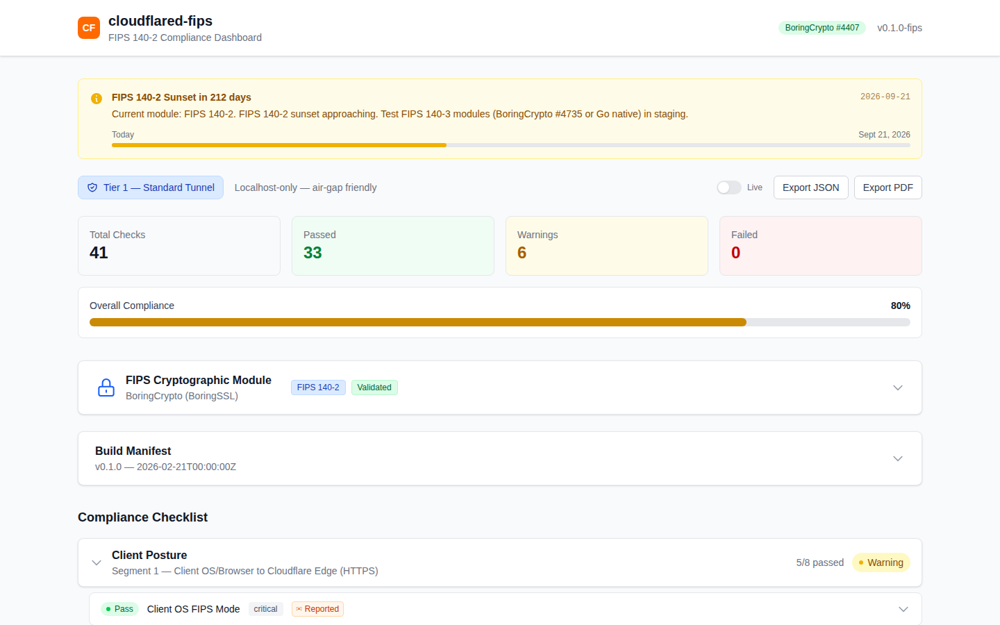
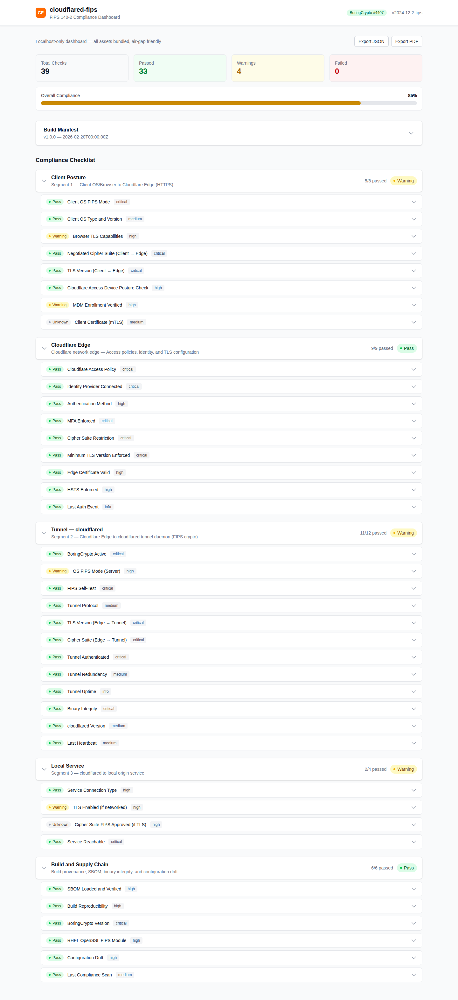
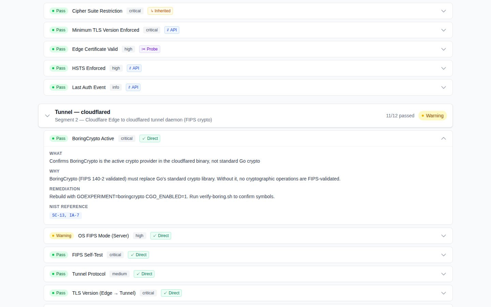
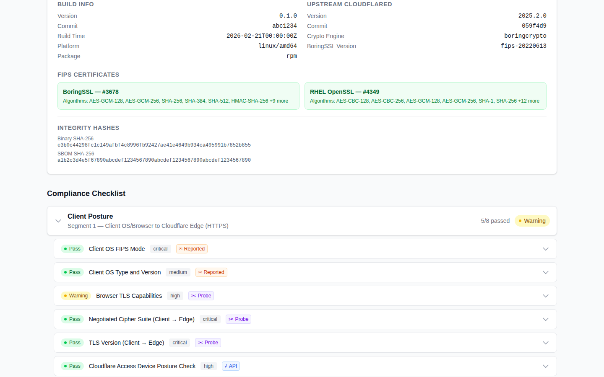
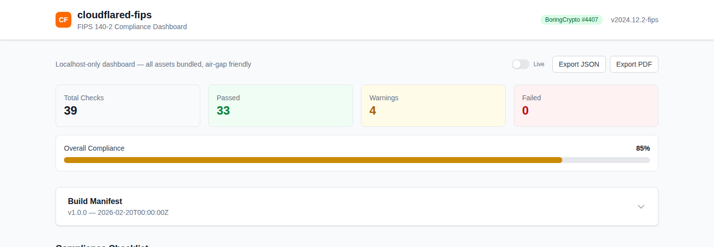

# cloudflared-fips

FIPS 140-2/3 compliant build of Cloudflare Tunnel (`cloudflared`) with end-to-end cryptographic observability, a compliance dashboard, fleet-wide compliance enforcement, and an AO authorization toolkit.

## Overview

Cloudflare Tunnel (`cloudflared`) uses standard Go crypto by default — it is **not** FIPS-validated. This project rebuilds it with validated cryptographic modules and wraps it in tooling that makes every link in the TLS chain visible and auditable.

Four core deliverables:

1. **FIPS-compliant cloudflared binary** using validated cryptographic modules (BoringCrypto on Linux, Go native FIPS 140-3 on macOS/Windows)
2. **Real-time compliance dashboard** — a 42-item checklist making every security property of the full connection chain transparently visible, with honest verification-method indicators (web GUI + terminal TUI)
3. **Zero-trust fleet management** — four-role architecture (controller, server, proxy, client) with mandatory posture reporting and compliance enforcement
4. **AO authorization documentation toolkit** — templates and auto-generated artifacts supporting an Authorizing Official authorization path

### Fleet Architecture

```
                        +---------------------------+
                        |       CONTROLLER          |
                        |  Cloudflare Tunnel owner   |
                        |  Fleet manager             |
                        |  Compliance enforcer       |
                        |  Reverse proxy -> servers  |
                        +------+------------+-------+
                               |            |
              +----------------+            +----------------+
              v                                              v
    +------------------+                      +------------------+
    |     SERVER(s)    |                      |     PROXY(ies)   |
    |  Origin service  |                      |  Client-side     |
    |  Posture agent   |                      |  FIPS fwd proxy  |
    |  No tunnel       |                      |  Own CF tunnel   |
    |  Registers w/    |                      |  Posture agent   |
    |  controller      |                      |  Clients connect |
    +------------------+                      |  through this    |
                                              +--------+---------+
                                                       |
                                              +--------+---------+
                                              |    CLIENT(s)     |
                                              |  Endpoint device |
                                              |  MANDATORY agent |
                                              +------------------+
```

| Role | Description | Binaries | Key Responsibility |
|------|-------------|----------|--------------------|
| **Controller** | Central hub | dashboard, selftest, agent, cloudflared | Owns Cloudflare tunnel, routes traffic to compliant servers, enforces compliance policy |
| **Server** | Origin service | selftest, agent | Registers service endpoint with controller, runs mandatory posture agent |
| **Proxy** | Client-side forward proxy | fips-proxy, selftest, agent, cloudflared | Own Cloudflare tunnel for FIPS egress, TLS termination for client traffic |
| **Client** | Endpoint device | selftest, agent | Mandatory FIPS posture reporting, non-compliant devices denied access |

## Three-Segment Architecture

A Cloudflare Tunnel connection has three segments, each with different crypto properties and different levels of verifiability:

```
┌──────────┐       ┌─────────────────┐       ┌──────────────────┐       ┌──────────────┐
│  Client  │──TLS──│ Cloudflare Edge │──TLS──│ cloudflared-fips │──TLS──│ Local Service│
│ (Seg. 1) │       │    (Seg. 2a)    │       │    (Seg. 2b)     │       │   (Seg. 3)   │
└──────────┘       └─────────────────┘       └──────────────────┘       └──────────────┘
  Reported /          Inherited from            Direct — we                Probe — TLS
  Probe only          FedRAMP authz             control this               handshake
```

| Segment | What we control | What we verify | Verification method |
|---------|----------------|----------------|---------------------|
| **Client → Edge** | Nothing (client OS) | Cipher suites via ClientHello, device posture via WARP/MDM | Probe, Reported |
| **Cloudflare Edge** | Cipher config, TLS min version, Access policies | API settings, TLS probe, certificate chain | API, Inherited |
| **Edge → cloudflared** | Crypto module, cipher enforcement, binary integrity | BoringCrypto symbols, self-test KATs, OS FIPS mode | Direct |
| **cloudflared → Origin** | TLS to local service | Negotiated cipher, cert validity, reachability | Probe |

### The Honesty Problem

Cloudflare does **not** hold a CMVP certificate. Their edge uses BoringSSL (which contains a FIPS-validated sub-module), but the CMVP certificates belong to Google, not Cloudflare. There is no API to verify FIPS mode is active on the edge server handling your request.

This project is transparent about this gap. Every dashboard item shows a **verification method badge**:

| Badge | Meaning |
|-------|---------|
| **Direct** | Measured locally (self-test, binary hash, OS FIPS mode) |
| **API** | Confirmed via Cloudflare API (cipher config, Access policy) |
| **Probe** | Confirmed via TLS handshake (negotiated cipher, cert chain) |
| **Inherited** | Relies on Cloudflare's FedRAMP authorization — not independently verifiable |
| **Reported** | Client-reported via WARP/device posture — trust depends on endpoint management |

## Deployment Tiers

Three tiers of increasing FIPS assurance:

### Tier 1: Standard Cloudflare Tunnel

```
Client → Cloudflare Edge → cloudflared-fips → Origin
```

Default. Edge crypto inherited from Cloudflare's FedRAMP Moderate authorization. Gap: edge crypto module not independently FIPS-validated.

### Tier 2: Cloudflare's FIPS 140 Level 3 Architecture (Keyless SSL + HSM)

This is [Cloudflare's official reference architecture for FIPS 140 Level 3 compliance](https://developers.cloudflare.com/reference-architecture/diagrams/security/fips-140-3/).

```
Client → Cloudflare Edge (Regional Services, US FedRAMP DCs)
              ↓ key operation request
         cloudflared-fips tunnel (BoringCrypto — carries app traffic + key ops)
              ↓
         Keyless SSL Module (software proxy)
              ↓ PKCS#11
         Customer HSM (FIPS 140-2 Level 3)
```

**The tunnel is doubly critical in Tier 2:** it carries both application data AND Keyless SSL cryptographic key operations. Every TLS handshake at the Cloudflare edge triggers a key operation that flows through this tunnel to the customer's HSM. The private key never leaves the HSM — only the signed result returns.

Traffic restricted to US FedRAMP-compliant data centers via Regional Services. Supported HSMs: AWS CloudHSM, Azure Dedicated/Managed HSM, Entrust nShield Connect, Fortanix, Google Cloud HSM, IBM Cloud HSM. Remaining gap: bulk encryption (AES-GCM) still via Cloudflare's edge BoringSSL.

### Tier 3: Self-Hosted FIPS Proxy

```
Client → FIPS Proxy (GovCloud) → [optional: Cloudflare for WAF/DDoS] → cloudflared-fips → Origin
```

Full control. `cmd/fips-proxy` is a Go reverse proxy built with BoringCrypto that terminates client TLS in your GovCloud environment. Every TLS termination point uses a FIPS-validated module you control.

## Crypto Module Matrix

The crypto backend is modular (`pkg/fipsbackend/`). Users select their FIPS module based on deployment platform:

| | BoringCrypto (Google) | Go Native FIPS 140-3 | Microsoft SystemCrypto |
|---|---|---|---|
| **FIPS 140-2 certs** | #3678, #4407 | None | Windows CNG #4825 |
| **FIPS 140-3 certs** | **#4735** | CAVP A6650 (CMVP pending) | Varies by platform |
| **Linux** | Yes (`GOEXPERIMENT=boringcrypto`) | Yes (`GODEBUG=fips140=on`) | Yes (OpenSSL) |
| **macOS** | No | Yes | Yes (CommonCrypto) |
| **Windows** | No | Yes | Yes (CNG) |
| **Requires CGO** | Yes | No | Platform-dependent |

### FIPS 140-2 Sunset: September 21, 2026

All FIPS 140-2 certificates move to the CMVP Historical List on this date. The dashboard displays a countdown banner with migration urgency. Migration path: BoringCrypto 140-3 (#4735) or Go native FIPS 140-3 (once CMVP validates).

### Post-Quantum Cryptography (PQC) Readiness

Cloudflare's edge already uses post-quantum key exchange (ML-KEM/Kyber) for connections to origin servers. Our crypto stack has PQC support at multiple levels:

| Component | PQC Status | Details |
|-----------|-----------|---------|
| **BoringSSL** | ML-KEM (Kyber) supported | BoringCrypto includes post-quantum key exchange; used in Cloudflare's edge |
| **Go 1.24+** | `crypto/mlkem` package | Native ML-KEM support via `crypto/mlkem`; available with `GODEBUG=fips140=on` |
| **Cloudflare edge → origin** | Active | Cloudflare uses PQC for edge-to-origin connections when supported |
| **Client → edge** | Browser-dependent | Chrome/Firefox support ML-KEM hybrid key exchange (X25519Kyber768) |

PQC is not yet part of FIPS 140-3 validation (NIST is developing FIPS 203/204/205 for ML-KEM/ML-DSA/SLH-DSA). When FIPS PQC standards are finalized, the modular backend can add PQC-specific validation checks.

## Client-Side FIPS Detection

The product detects client FIPS capability through:

- **TLS ClientHello inspection** — absence of ChaCha20-Poly1305 indicates FIPS mode (FIPS clients only offer AES-GCM)
- **JA4 fingerprinting** — simplified TLS client fingerprint for FIPS-mode pattern matching
- **Device posture API** — agents report OS FIPS mode, MDM enrollment, disk encryption via `POST /api/v1/posture`
- **Cloudflare Access integration** — device posture checks (OS version, MDM, disk encryption)

## Directory Structure

```
├── build/
│   ├── Dockerfile.fips              # RHEL UBI 9 CI build container (binary is distro-agnostic)
│   ├── Dockerfile.fips-proxy        # Tier 3 FIPS proxy container
│   ├── build.sh                     # Build orchestrator
│   └── packaging/                   # RPM, DEB, macOS .pkg, Windows MSI (WiX)
├── cmd/
│   ├── selftest/                    # Standalone self-test CLI
│   ├── dashboard/                   # Compliance dashboard + fleet controller
│   ├── fips-proxy/                  # Client-side FIPS forward proxy
│   ├── agent/                       # Lightweight FIPS posture agent (~11 MB)
│   └── tui/                         # TUI: setup wizard + status monitor
├── internal/
│   ├── selftest/                    # KATs, cipher validation, BoringCrypto detection
│   ├── compliance/                  # Live compliance checker (system + config + binary)
│   ├── dashboard/                   # HTTP API handlers + SSE + WebSocket
│   └── tui/                         # Terminal UI (Bubbletea)
│       ├── config/                  # Config struct, YAML write/read, validators
│       ├── common/                  # Shared components: textinput, toggle, selector, ingress
│       ├── wizard/                  # 5-page setup wizard
│       └── status/                  # Live compliance status monitor
├── pkg/
│   ├── buildinfo/                   # Linker-injected build metadata
│   ├── manifest/                    # Build manifest types + read/write
│   ├── fipsbackend/                 # Modular crypto backend + 140-3 migration tracking
│   ├── cfapi/                       # Cloudflare API client (zone, Access, tunnel health)
│   ├── clientdetect/                # TLS ClientHello inspector, JA4, device posture
│   ├── deployment/                  # Deployment tier config (standard/regional/self-hosted)
│   └── signing/                     # Artifact signing (GPG + cosign) and verification
├── dashboard/                       # React + TypeScript + Tailwind (Vite)
├── configs/
│   ├── cloudflared-fips.yaml        # Sample tunnel + FIPS config with deployment_tier
│   └── build-manifest.json          # Sample manifest with FIPS certificate references
├── scripts/
│   ├── check-fips.sh                # Post-build FIPS validation
│   ├── verify-boring.sh             # Verify BoringCrypto symbols in binary
│   ├── generate-manifest.sh         # Produce build-manifest.json
│   ├── generate-sbom.sh             # CycloneDX + SPDX SBOM generation
│   ├── generate-docs.sh             # AO doc package (PDF/HTML via pandoc)
│   ├── audit-crypto-deps.sh         # Full dependency tree crypto audit
│   ├── verify-boring-version.sh     # BoringCrypto 140-2 vs 140-3 detection
│   ├── verify-tier-fips140-3.sh     # Deployment tier 140-3 readiness test
│   └── sign-artifacts.sh            # GPG signing + signature manifest
├── deploy/
│   ├── terraform/                   # AWS GovCloud Terraform (ECS Fargate)
│   └── cloudformation/              # AWS CloudFormation equivalent
├── docs/                            # AO package: SSP, crypto usage, control mapping,
│                                    # hardening guide, monitoring plan, IR addendum
└── .github/workflows/
    ├── fips-build.yml               # Cross-platform build + package + sign
    └── compliance-check.yml         # PR validation (lint, test, dashboard build)
```

## Install

### RHEL / Rocky / Alma 9 (RPM)

```bash
sudo dnf install https://github.com/JongoDB/cloudflared-fips/releases/download/v0.3.1/cloudflared-fips-0.3.1-1.el9.x86_64.rpm
```

### macOS

```bash
curl -fLO https://github.com/JongoDB/cloudflared-fips/releases/download/v0.3.1/cloudflared-fips-0.3.1.pkg
sudo installer -pkg cloudflared-fips-0.3.1.pkg -target /
```

The RPM/pkg installs all binaries to `/usr/local/bin/` and runs the FIPS self-test automatically.

## Binaries

The RPM ships six binaries. Which ones run on a given node depends on its role.

| Binary | Description | Used by |
|--------|-------------|---------|
| `cloudflared-fips-selftest` | Runs FIPS Known Answer Tests (KATs) against NIST CAVP vectors (AES-GCM, SHA-256/384, HMAC, ECDSA, RSA), verifies the crypto backend is active, validates cipher suites, and checks OS FIPS mode. Exits non-zero if any check fails. | All roles |
| `cloudflared-fips-dashboard` | HTTP API server for compliance state, fleet management (when `--fleet-mode` is set), SSE real-time events, and the embedded web UI. Controllers run this as their primary service. Binds `127.0.0.1:8080` by default. | Controller |
| `cloudflared-fips-tui` | Interactive terminal UI. `setup` subcommand walks through role-specific configuration and provisions the node. `status` subcommand polls the dashboard API and renders a live compliance monitor. | All roles (setup), Controller (status) |
| `cloudflared-fips-proxy` | Reverse proxy that terminates client TLS using BoringCrypto. Used in Tier 3 deployments where you control the client-facing TLS termination point instead of relying on Cloudflare's edge. Includes ClientHello inspection and JA4 fingerprinting. | Proxy |
| `cloudflared-fips-agent` | Lightweight (~11 MB) posture agent that reports OS FIPS mode, disk encryption, WARP status, and other compliance data to the controller. Runs as a systemd timer that checks in periodically. | Server, Proxy, Client |
| `cloudflared-fips-provision` | Shell script that handles the full provisioning sequence: installs Go, enables OS FIPS mode (with reboot), builds binaries from source with BoringCrypto, writes config, creates systemd units, enrolls with the controller, and starts services. Idempotent — safe to re-run after reboot. | All roles (one-time setup) |

### What runs on each role

| Role | Services (systemd) | Purpose |
|------|-------------------|---------|
| **Controller** | `cloudflared-fips-dashboard` (fleet mode), `cloudflared` (tunnel), `cloudflared-fips-agent` | Owns the Cloudflare Tunnel, runs the fleet API + compliance dashboard, enforces compliance policy, routes traffic only to compliant servers |
| **Server** | `cloudflared-fips-agent` | Registers its origin service endpoint with the controller, reports FIPS posture periodically. Does **not** run its own tunnel — traffic reaches it through the controller's tunnel. |
| **Proxy** | `cloudflared-fips-proxy`, `cloudflared` (tunnel), `cloudflared-fips-agent` | Runs a client-facing FIPS TLS proxy in your environment (Tier 3). Has its own Cloudflare Tunnel for egress. Clients connect through this proxy instead of directly to Cloudflare. |
| **Client** | `cloudflared-fips-agent` | Mandatory posture agent on endpoint devices. Reports OS FIPS mode, disk encryption, WARP status to the controller. Non-compliant devices are denied access. |

## Provisioning

There are two ways to provision a node: the interactive TUI wizard or the non-interactive CLI.

### Prerequisites

Before provisioning, you need:

| Role | Requirements |
|------|-------------|
| **Controller** | A Cloudflare Tunnel token (get from [Zero Trust dashboard](https://one.dash.cloudflare.com/) → Networks → Tunnels → Create). Optionally: a CF API token for edge compliance checks. |
| **Server** | The controller's URL and an enrollment token generated by the controller admin. The origin service (e.g., your app on port 8443) should be running or ready to start. |
| **Proxy** | A Cloudflare Tunnel token (proxy gets its own tunnel), TLS certificate + key for client-facing connections, the controller's URL, and an enrollment token. |
| **Client** | The controller's URL and an enrollment token. |

### Option A: Interactive wizard (TUI)

```bash
cloudflared-fips-tui setup
```

The wizard adapts to the selected role:

| Role | Pages |
|------|-------|
| **Controller** | Role & Tier → Controller & Tunnel → Dashboard Wiring → FIPS Options → Review & Provision |
| **Server** | Role & Tier → Origin Service → FIPS Options → Review & Provision |
| **Proxy** | Role & Tier → FIPS Forward Proxy → FIPS Options → Review & Provision |
| **Client** | Role & Tier → Agent Config → FIPS Options → Review & Provision |

Each field has inline help text — focus a field and read the help block below it for guidance on where to find values (API tokens, tunnel tokens, enrollment tokens, etc.).

After the Review page, select **Provision this node** to run the full provisioning sequence. The provisioner will:
1. Enable OS FIPS mode (RHEL/Rocky/Alma: `fips-mode-setup --enable`)
2. **Reboot** if FIPS mode was just enabled (see below)
3. Install Go and build dependencies (skipped when binaries are pre-installed via RPM)
4. Build all fleet binaries from source with `GOEXPERIMENT=boringcrypto` (skipped via RPM)
5. Write the config to `/etc/cloudflared-fips/config.yaml`
6. Create systemd units for the role's services
7. Enroll with the controller (server/proxy/client roles)
8. Start services

**After reboot:** If FIPS mode was just enabled, the machine reboots automatically. When you log back in, you'll see a banner with the exact command to resume provisioning. Run it — provisioning picks up where it left off (FIPS is already active, so it skips straight to config and services).

### Option B: Non-interactive CLI

For scripted or headless deployments:

**Controller:**
```bash
sudo cloudflared-fips-provision --role controller \
  --tunnel-token eyJhIjoiN... \
  --protocol quic \
  --admin-key "$(openssl rand -hex 16)" \
  --enforcement-mode audit
```

**Server:**
```bash
sudo cloudflared-fips-provision --role server \
  --controller-url https://controller.internal:8080 \
  --enrollment-token <TOKEN> \
  --service-name my-api \
  --service-host 0.0.0.0 \
  --service-port 8443 \
  --service-tls
```

**Proxy:**
```bash
sudo cloudflared-fips-provision --role proxy \
  --controller-url https://controller.internal:8080 \
  --enrollment-token <TOKEN> \
  --tunnel-token eyJhIjoiN... \
  --cert /etc/pki/tls/certs/proxy.pem \
  --key /etc/pki/tls/private/proxy-key.pem
```

**Client:**
```bash
sudo cloudflared-fips-provision --role client \
  --controller-url https://controller.internal:8080 \
  --enrollment-token <TOKEN>
```

Additional flags: `--no-fips` (skip FIPS mode for dev/test), `--node-name <NAME>`, `--node-region <REGION>`.

### Generating enrollment tokens

On the controller, generate tokens for fleet nodes:

```bash
curl -H "Authorization: Bearer <admin-key>" \
  -X POST https://controller.internal:8080/api/v1/fleet/tokens
```

Or via the fleet API from any authenticated client. Tokens are single-use — each node consumes one during enrollment.

### Post-provisioning verification

After provisioning and any required reboot:

```bash
# Verify FIPS self-test passes
cloudflared-fips-selftest

# Check services are running (role-dependent)
systemctl status cloudflared-fips-dashboard  # controller
systemctl status cloudflared-fips-agent      # all roles

# Check fleet enrollment (server/proxy/client)
curl -s http://localhost:8080/api/v1/fleet/nodes | jq .
```

## Development Quick Start

For building from source (contributors and developers):

### Prerequisites

- **Go 1.24+** — CGO support needed for Linux FIPS builds only.
- **`cloudflared`** (optional) — if installed, the setup wizard can list existing tunnels.
- **Docker** (for FIPS container builds)
- **Node.js 22+** (for web dashboard development)

### 1. Configure with the setup wizard

```bash
make setup
```

The Makefile auto-selects the right FIPS backend per platform:
- **Linux:** `GOEXPERIMENT=boringcrypto` (BoringCrypto, CMVP #4735)
- **macOS/Windows:** `GODEBUG=fips140=on` (Go native FIPS 140-3, CAVP A6650)

### 2. Run the self-test

```bash
make selftest
```

### 3. Start the dashboard API server

```bash
make dashboard
```

Starts the compliance API at `http://127.0.0.1:8080`.

Useful flags:
```bash
make dashboard -- --config configs/cloudflared-fips.yaml \
  --metrics-addr localhost:2000 \
  --ingress-targets localhost:443
```

### 4. Monitor compliance from the terminal

```bash
make status
```

Polls the dashboard API and renders all checklist items. Keys: `q` quit, `r` refresh, arrows scroll.

### Enabling Cloudflare Edge checks

The Edge section (11 checks) requires a Cloudflare API token:

1. Go to [Cloudflare API Tokens](https://dash.cloudflare.com/profile/api-tokens) → **Create Token** → **Custom token**
2. Add permissions:
   - **Zone > Zone > Read**
   - **Zone > Access: Apps and Policies > Read**
   - **Zone > SSL and Certificates > Read**
   - **Account > Cloudflare Tunnel > Read**
3. Scope to your zone and account

```bash
CF_API_TOKEN=your-token \
  CF_ZONE_ID=your-zone-id \
  CF_ACCOUNT_ID=your-account-id \
  CF_TUNNEL_ID=your-tunnel-id \
  make dashboard
```

### Other commands

| Command | Description |
|---------|-------------|
| `make build-fips` | Build the FIPS binary to `build-output/` |
| `make tui` | Build the TUI binary for distribution |
| `make dashboard-dev` | Start the React web dashboard (dev mode, needs `npm install` first) |
| `make dashboard-build` | Build the React dashboard for production |
| `make docker-build` | Build the FIPS Docker image (RHEL UBI 9) |
| `make docs` | Generate AO documentation package (PDF/HTML) |
| `make crypto-audit` | Run full crypto dependency audit |
| `make manifest` | Generate build manifest |
| `make sbom` | Generate SBOM (CycloneDX + SPDX) |
| `make test` | Run Go tests with FIPS flags |
| `make lint` | Run Go linters |
| `make clean` | Remove build artifacts |

## Dashboard

The compliance dashboard displays 42 checklist items across five sections:

- **Client Posture** (8 items) — OS FIPS mode, TLS capabilities, device posture, MDM
- **Cloudflare Edge** (11 items) — Access policy, cipher restriction, TLS version, HSTS, certificates, Keyless SSL, Regional Services
- **Tunnel** (12 items) — BoringCrypto active, self-test KATs, cipher suites, binary integrity, tunnel health
- **Local Service** (4 items) — TLS enabled, cipher negotiation, cert validity, reachability
- **Build & Supply Chain** (7 items) — SBOM, manifest, reproducibility, signatures, FIPS certs, module sunset status

### Screenshots

#### Dashboard Overview
FIPS 140-2 sunset countdown banner, Tier 1 deployment badge, FIPS Cryptographic Module card (showing active backend, CMVP cert, 140-2/3 badge), 41 compliance checks with pass/warn/fail summary, verification method badges, and live SSE toggle.



#### Full Dashboard
All five sections with status, severity, and verification method per item. FIPS backend card and build manifest expandable above the checklist.



#### Expanded Checklist Item
Each item expands to show What, Why, Remediation steps, and NIST SP 800-53 control references.



#### Build Manifest Panel
Build metadata, upstream cloudflared version, FIPS certificate details, and integrity hashes.



#### Summary Bar
Sunset banner with progress bar, deployment tier badge, compliance summary (80%), and export controls.



### Dashboard API

| Endpoint | Description |
|----------|-------------|
| `GET /api/v1/compliance` | Full compliance state (all sections) |
| `GET /api/v1/manifest` | Build manifest |
| `GET /api/v1/selftest` | On-demand FIPS self-test |
| `GET /api/v1/backend` | Active FIPS crypto backend info |
| `GET /api/v1/events` | SSE stream (real-time updates) |
| `GET /api/v1/ws` | WebSocket (real-time updates with SSE fallback) |
| `GET /api/v1/clients` | TLS ClientHello inspection results |
| `GET /api/v1/posture` | Device posture reports |
| `POST /api/v1/posture` | Submit device posture report |
| `GET /api/v1/deployment` | Deployment tier info |
| `GET /api/v1/migration` | FIPS 140-2 → 140-3 migration status |
| `GET /api/v1/migration/backends` | All backend migration details |
| `GET /api/v1/signatures` | Artifact signature manifest |
| `GET /api/v1/compliance/export` | JSON export of full compliance state |
| `GET /api/v1/mdm/devices` | MDM-enrolled device compliance list |
| `GET /api/v1/mdm/summary` | MDM fleet compliance summary |
| `GET /health` | Health check |

#### Fleet API (controller only, `--fleet-mode`)

| Endpoint | Description |
|----------|-------------|
| `POST /api/v1/fleet/tokens` | Create enrollment token (admin) |
| `GET /api/v1/fleet/tokens` | List enrollment tokens (admin) |
| `POST /api/v1/fleet/enroll` | Node enrollment (token auth) |
| `POST /api/v1/fleet/report` | Submit compliance report (node auth) |
| `POST /api/v1/fleet/heartbeat` | Node keepalive (node auth) |
| `GET /api/v1/fleet/nodes` | List nodes (filterable by role/region/status) |
| `GET /api/v1/fleet/nodes/{id}` | Get node details |
| `GET /api/v1/fleet/nodes/{id}/report` | Get node's latest compliance report |
| `GET /api/v1/fleet/summary` | Fleet-wide aggregate statistics |
| `GET /api/v1/fleet/events` | SSE stream for fleet changes |
| `GET /api/v1/fleet/policy` | Get compliance enforcement policy |
| `PUT /api/v1/fleet/policy` | Update compliance policy (admin) |
| `GET /api/v1/fleet/routes` | Effective routing table (compliant servers only) |

## Terminal UI (TUI)

A lightweight alternative to the web dashboard for headless and SSH environments, built with [Bubbletea](https://github.com/charmbracelet/bubbletea).

### Setup Wizard

```bash
make setup
```

Interactive wizard with role-specific pages:

| Page | Controller | Server | Proxy | Client |
|------|-----------|--------|-------|--------|
| **Role & Tier** | Select role + deployment tier | Select role | Select role | Select role |
| **Config** | Tunnel token, ingress, protocol, compliance policy, admin key | Service endpoint (name, host, port), fleet enrollment | Listen addr, TLS cert/key, tunnel token, fleet enrollment | Controller URL, enrollment token |
| **Dashboard Wiring** | CF API, MDM, metrics | - | - | - |
| **Tier Specific** | Keyless SSL / proxy settings (tier 2/3 only) | - | - | - |
| **FIPS Options** | Self-test, fail-on-failure, signature verification | Same | Same | Same |
| **Review** | Scrollable summary, provision command | Same | Same | Same |

Navigation: `Tab`/`Enter` = next, `Shift+Tab` = back, `Ctrl+C` = quit.

### Status Monitor

```bash
make status
```

Or with custom options:

```bash
go run ./cmd/tui status --api localhost:8080 --interval 5s
```

Polls `GET /api/v1/compliance` and renders all 42 items grouped by section:

```
 cloudflared-fips v0.1.0 | Compliance Status | Updated 12:34:56

 ┌──────────────────────────────────────────────────────────┐
 │  38/41 PASS   2 WARN   1 FAIL              93% ██████░  │
 └──────────────────────────────────────────────────────────┘

 CLIENT POSTURE                                    7/8 pass
   ● Client OS FIPS Mode                              PASS
   ○ Browser TLS Capabilities                         WARN
   ...

 TUNNEL — CLOUDFLARED                            11/12 pass
   ● BoringCrypto Active                              PASS
   ✖ Binary Integrity                                 FAIL
   ...

 [q] Quit  [r] Refresh | Polling every 5s | Connected to localhost:8080
```

Keys: `q` = quit, `r` = force refresh, arrows/PgUp/PgDn = scroll.

## FIPS Build Pipeline

### Linux (primary)

Uses `GOEXPERIMENT=boringcrypto` on RHEL UBI 9. BoringCrypto's FIPS-validated `.syso` object files are statically linked into the binary — the validated crypto travels with the binary and does **not** depend on host OS OpenSSL.

1. Build on RHEL UBI 9 with `GOEXPERIMENT=boringcrypto` + `CGO_ENABLED=1`
2. Verify `_goboringcrypto_` symbols are present
3. Run Known Answer Tests against NIST CAVP vectors (AES-GCM, SHA-256/384, HMAC, ECDSA, RSA)
4. Validate only FIPS-approved cipher suites are available
5. Generate build manifest with cryptographic provenance
6. Package as RPM, DEB, and OCI container
7. Sign artifacts with GPG; sign containers with cosign (Sigstore)

### macOS / Windows

Uses `GODEBUG=fips140=on` (Go 1.24+ native FIPS 140-3 module, CAVP cert A6650, CMVP pending). No CGO required. Packaged as macOS `.pkg` and Windows `.msi`.

### Supported Host OSes

The binary uses FIPS-validated crypto on any Linux (amd64/arm64). For full-stack FIPS, the host OS should also run in FIPS mode:

| Distro | FIPS 140-3 | FIPS Mode |
|--------|-----------|-----------|
| RHEL 9 | Validated (#4746, #4857) | `fips-mode-setup --enable` |
| Ubuntu Pro 22.04 | Validated | `ua enable fips` |
| Amazon Linux 2023 | Validated | `fips-mode-setup --enable` |
| SUSE SLES 15 SP6+ | Validated | `fips=1` boot param |
| Oracle Linux 9 | Validated | `fips-mode-setup --enable` |
| AlmaLinux 9.2+ | Validated | `fips-mode-setup --enable` |

## AO Documentation Package

Templates for supporting an Authorizing Official authorization path:

- **System Security Plan (SSP)** — module boundaries, validated modules with CMVP certs, crypto operations mapped to modules
- **Cryptographic Module Usage Document** — operation-to-algorithm-to-module-to-certificate mapping
- **FIPS Compliance Justification Letter** — structured AO argument for leveraged validated module approach
- **Client Endpoint Hardening Guide** — Windows GPO, RHEL, macOS, MDM policy templates
- **Continuous Monitoring Plan** — dashboard as monitoring tool, re-verification on updates
- **Incident Response Addendum** — crypto failure procedures
- **NIST 800-53 Control Mapping** — SC-8, SC-13, SC-12, IA-7, SA-11, CM-14

## Artifact Signing

- **Binaries and packages:** GPG detached signatures (`.sig` files)
- **Container images:** cosign (Sigstore) keyless signing in CI
- **Signature manifest:** `signatures.json` with artifact hashes and signer identity
- CI `sign-artifacts` job runs automatically on tagged releases

## License

See LICENSE file for details.
