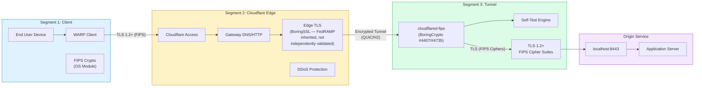
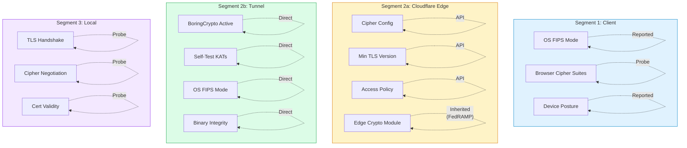
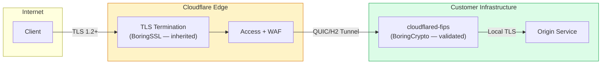
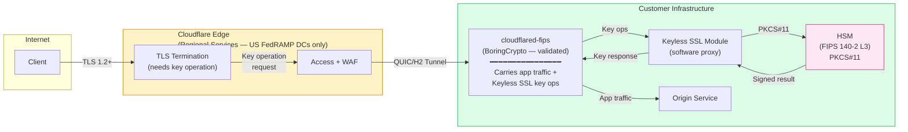
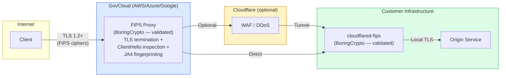
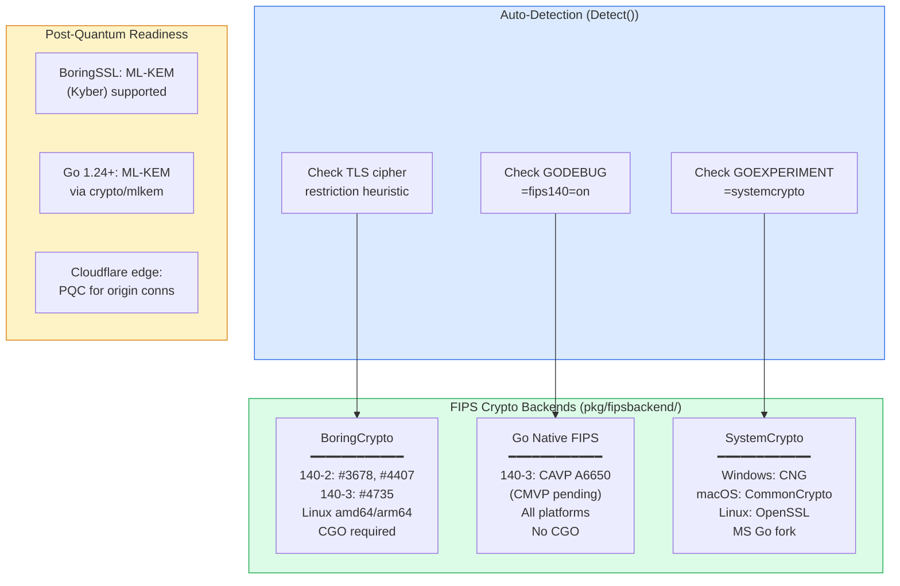
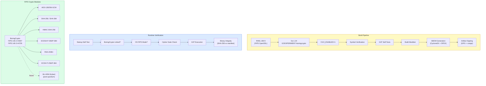
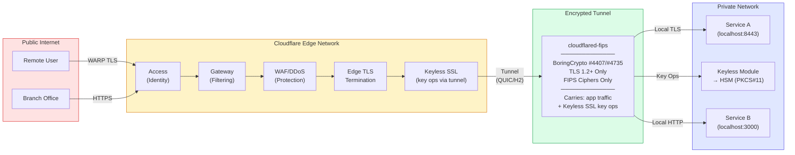
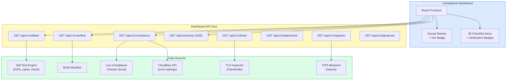
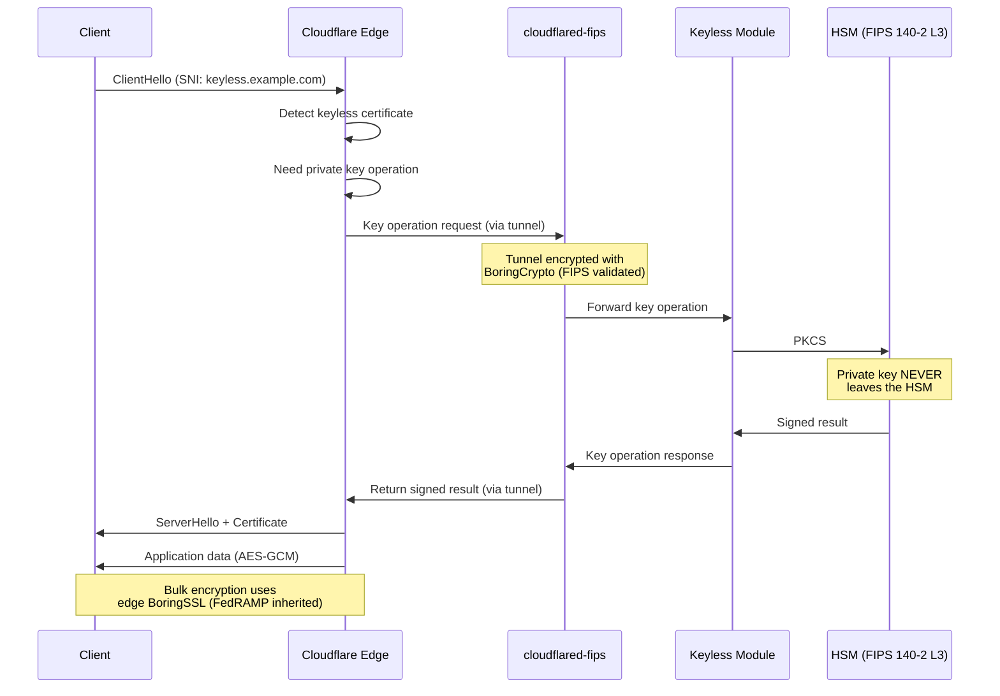

# Architecture Diagrams

## Three-Segment FIPS Architecture

The following diagrams illustrate the cloudflared-fips architecture across three network segments, with cryptographic module annotations at each boundary.

### End-to-End Data Flow

### Verification Method per Segment

Each segment has a different level of verifiability:

---

## Deployment Tiers

### Tier 1: Standard Cloudflare Tunnel

**Edge crypto:** Inherited from Cloudflare FedRAMP Moderate authorization. Not independently verifiable.
**Key management:** Cloudflare-managed edge keys.
**Gap:** Edge crypto module FIPS validation cannot be independently confirmed.

### Tier 2: Cloudflare's Official FIPS 140 Level 3 Architecture

This is [Cloudflare's reference architecture for FIPS 140 Level 3 compliance](https://developers.cloudflare.com/reference-architecture/diagrams/security/fips-140-3/). The tunnel carries **both application traffic AND cryptographic key operations** for Keyless SSL.

**Why the tunnel is critical in Tier 2:** Every TLS handshake at the Cloudflare edge triggers a key operation that flows through this tunnel to the customer's HSM. The private key **never leaves the HSM** — only the signed result returns. A compromised or non-validated tunnel binary could intercept these key operations.

**Edge crypto:** Bulk encryption (AES-GCM) still performed by Cloudflare's edge BoringSSL. Key material protected by customer's HSM.
**Key management:** Customer's FIPS 140-2 Level 3 HSM via PKCS#11.

**Supported HSMs:**
- AWS CloudHSM
- Azure Dedicated HSM / Azure Managed HSM
- Entrust nShield Connect
- Fortanix Data Security Manager
- Google Cloud HSM
- IBM Cloud HSM
- SoftHSMv2 (development/testing only)

### Tier 3: Self-Hosted FIPS Edge Proxy

**Edge crypto:** Fully controlled — customer's FIPS proxy terminates TLS with a validated module.
**Key management:** Customer-managed (local cert/key, or HSM).
**No gap:** Every TLS termination point uses a FIPS-validated module the customer controls.

---

## Cryptographic Module Matrix

---

## Cryptographic Module Deployment

---

## Network Security Boundaries

---

## Compliance Dashboard Architecture

---

## Keyless SSL Key Operation Flow (Tier 2 Detail)

This diagram shows the detailed flow of a single TLS handshake when Keyless SSL is configured with a Cloudflare Tunnel. This is [Cloudflare's reference architecture for FIPS 140 Level 3](https://developers.cloudflare.com/reference-architecture/diagrams/security/fips-140-3/).

