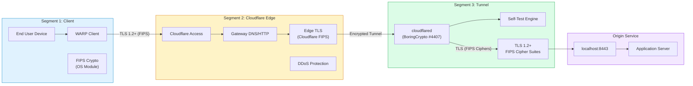
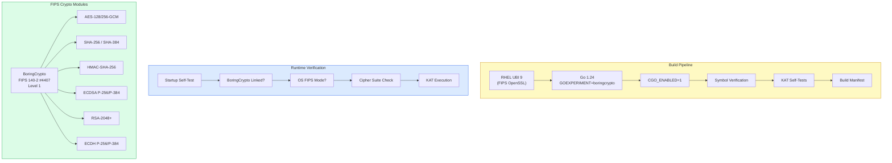
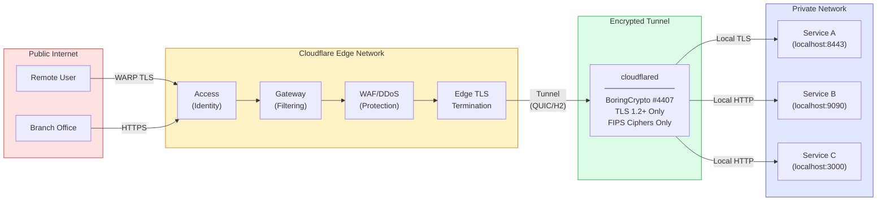
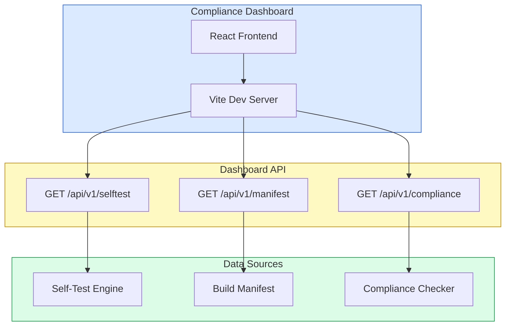

# Architecture Diagram

## Three-Segment FIPS Architecture

The following diagrams illustrate the cloudflared-fips architecture across three network segments, with cryptographic module annotations at each boundary.

### End-to-End Data Flow

### Cryptographic Module Deployment

### Network Security Boundaries

### Compliance Dashboard Architecture

